# BLADE: Bilevel Low-rank Adaptive Data Erasure

## Algorithm

```
Algorithm 1: BLADE
─────────────────────────────────────────────────────────────────────────
Input: Model M with LoRA adapters, forget set D_fgt, retain set D_ret,
       outer LR η_θ, inner LR η_in, safety cap T, inner iterations K,
       epsilon multiplier ε_mul, penalty weight ρ

Output: Unlearned model

 1  Initialize: LoRA(M), λ ← 1.0, SGD_in(lr=η_in), Adam_out(lr=η_θ)

    ┌─────────────────────────────────────────────────────────────────┐
    │ AUTO-EPSILON (step 0)                                           │
    │                                                                 │
 2  │  Run K inner SGD steps on D_ret                                 │
 3  │  ε ← ε_mul × mean(inner retain losses)                         │
    └─────────────────────────────────────────────────────────────────┘

    ┌─────────────────────────────────────────────────────────────────┐
    │ MAIN LOOP                                                       │
    │                                                                 │
 4  │  for t = 1, ..., T do                                           │
    │                                                                 │
    │    // ── Inner loop: minimize retain loss ──                    │
 5  │    for k = 1, ..., K do                                         │
 6  │      θ ← θ − η_in · ∇_θ L_CE(D_ret; θ)                        │
    │    end                                                          │
    │                                                                 │
    │    // ── Outer step: minimize forget loss subject to constraint ─│
 7  │    Compute L_fgt = L_forget(D_fgt; θ),  L_ret = L_CE(D_ret; θ) │
 8  │    r ← L_ret − ε                                                │
 9  │    L_ALM ← L_fgt + λ·r + (ρ/2)·max(0, r)²                     │
10  │    θ ← θ − η_θ · ∇_θ L_ALM                                     │
    │                                                                 │
    │    // ── Dual variable update (asymmetric) ──                   │
11  │    if r > 0: λ ← λ + ρ·r                                       │
12  │    else:     λ ← λ + 0.1·ρ·r                                   │
13  │    λ ← clamp(λ, λ_min, λ_max)                                  │
    └─────────────────────────────────────────────────────────────────┘

    ┌─────────────────────────────────────────────────────────────────┐
    │ ADAPTIVE SIGNALS                                                │
    │                                                                 │
    │  // ── LR Calibration (one-shot at t = 0.1·T) ──               │
14  │  Measure L_fgt decay rate over calibration window               │
15  │  Scale η_θ so L_fgt drops ~50% over T/3 steps                  │
    │                                                                 │
    │  // ── Phase Transition Detection ──                            │
16  │  T_trans ← first t where r > ε for 3 consecutive steps         │
    │                                                                 │
    │  // ── Convergence Stopping ──                                  │
17  │  After t > 1.6·T_trans and L_fgt dropped > 50%:                 │
18  │    Stop when |vel_ema(L_fgt)| < 0.01 × peak_vel                │
    └─────────────────────────────────────────────────────────────────┘

19  Merge LoRA into base model, return M
```

**Auto-Epsilon** (lines 2–3) calibrates the retain constraint threshold from a single pass over the retain set, eliminating manual tuning.

**Inner Loop** (lines 5–6) runs K SGD steps to restore retain performance before each outer update. This bilevel structure decouples forgetting from retention.

**Outer Step** (lines 7–10) minimizes the forget loss under an Augmented Lagrangian constraint on retain loss. The penalty term activates only when the constraint is violated.

**Asymmetric Dual Update** (lines 11–13) increases λ aggressively when the retain constraint is violated but decreases it gently when satisfied, preventing oscillation around ε.

**LR Calibration** (lines 14–15) adjusts the outer learning rate once, early in training, to match a target forgetting pace regardless of model/dataset scale.

**Phase Transition** (line 16) detects when the retain constraint becomes actively binding — the point where forgetting begins trading off against retention.

**Convergence Stopping** (lines 17–18) halts training when the forget loss velocity drops below 1% of its peak, measured purely in relative terms with no dataset-specific thresholds.

---

## Loss Dynamics: BLADE vs PDU

BLADE figures: red = forget loss, blue = retain loss, purple dashed = λ, orange dash-dot = ε, green dotted = T_trans, gray dashed = convergence.
PDU figures: red (left axis) = forget loss, blue (right axis) = retain loss.

### MUSE Books — Llama-2-7B

| BLADE (HM = 0.823) | PDU (HM = 0.602) |
|---|---|
| 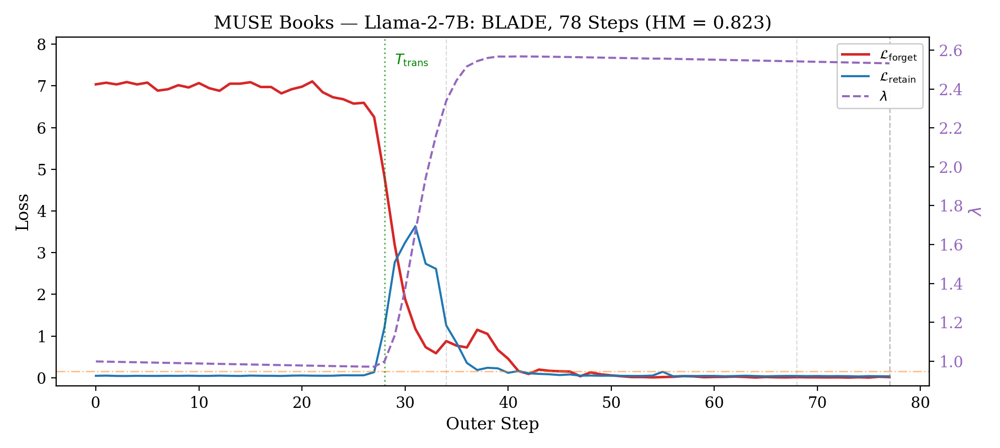 | 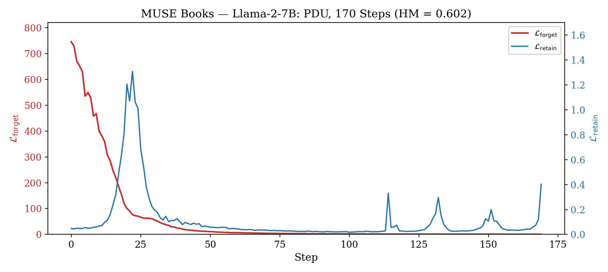 |

### MUSE News — Llama-2-7B

| BLADE (HM = 0.542) | PDU (HM = 0.581) |
|---|---|
| 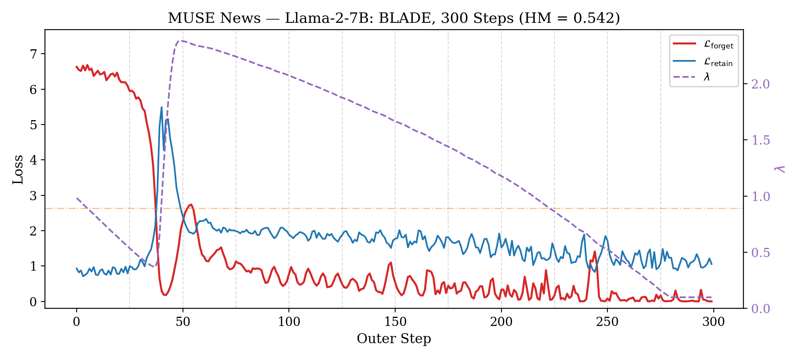 | 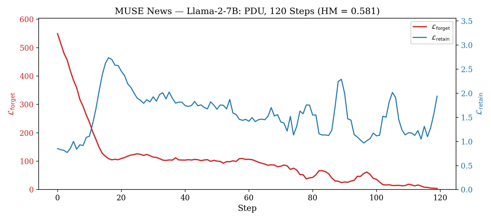 |

### TOFU forget01 — Llama-3.2-1B

| BLADE (HM = 0.811) | PDU (HM = 0.690) |
|---|---|
| 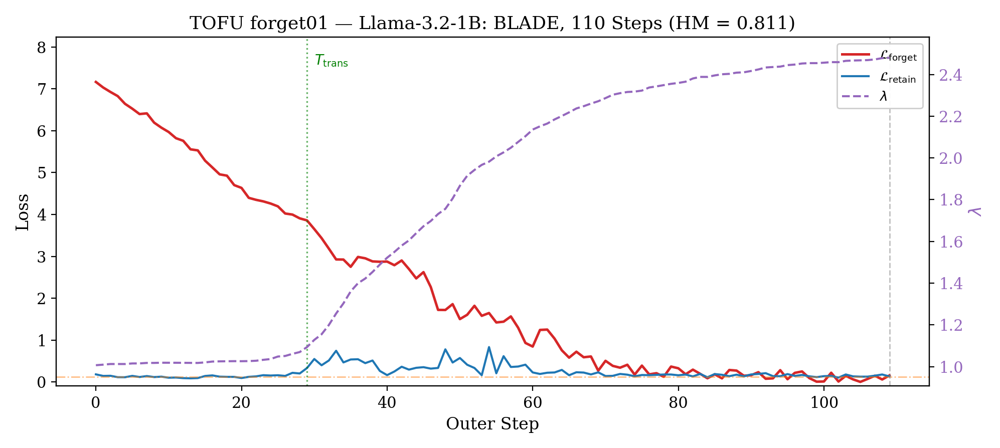 | 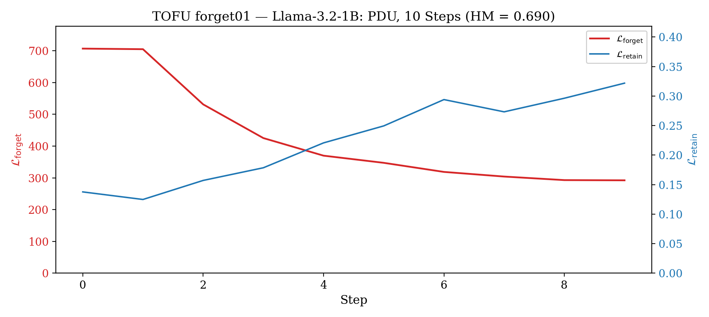 |

### TOFU forget05 — Llama-3.2-1B

| BLADE (HM = 0.804) | PDU (HM = 0.740) |
|---|---|
| 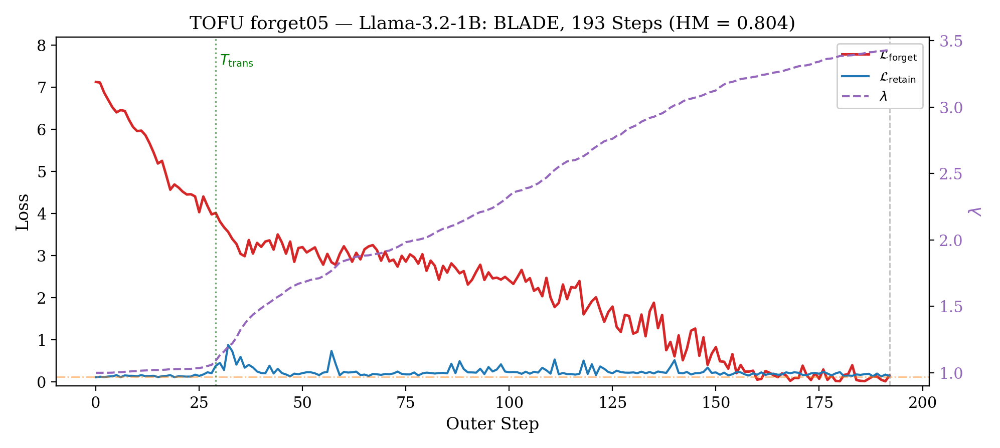 | 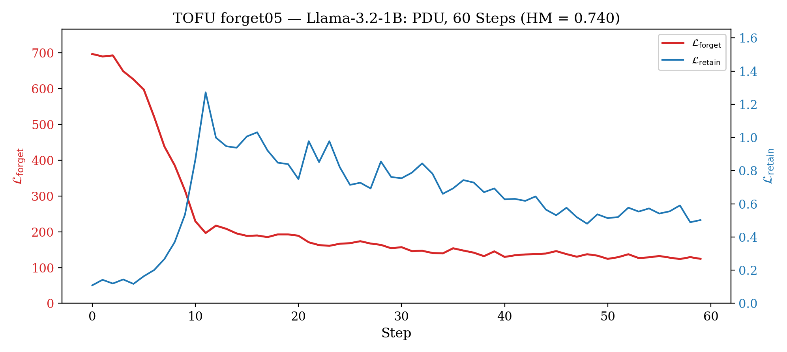 |

### TOFU forget10 — Llama-3.2-1B

| BLADE (HM = 0.808) | PDU (HM = 0.797) |
|---|---|
| 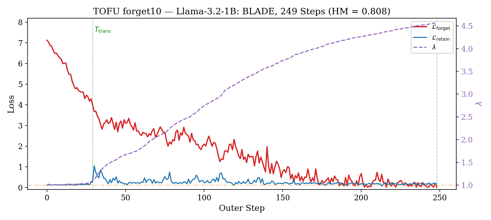 | 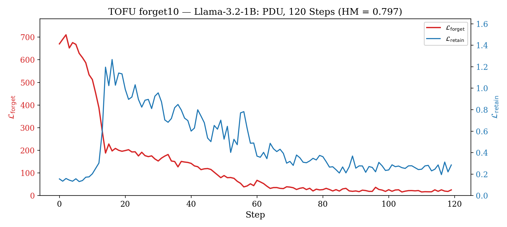 |

### TOFU forget01 — Llama-3.2-3B

| BLADE (HM = 0.849) | PDU (HM = 0.742) |
|---|---|
| 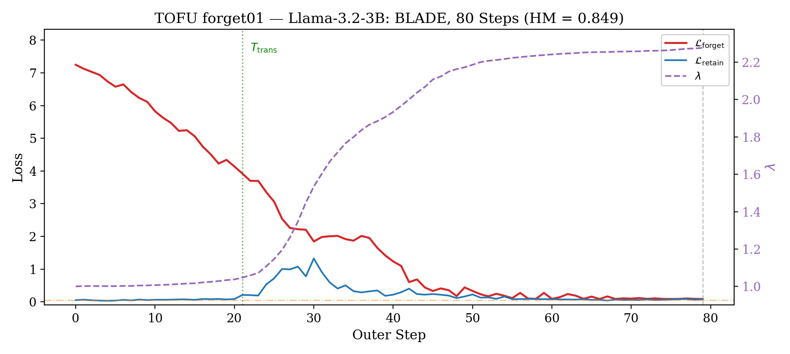 | 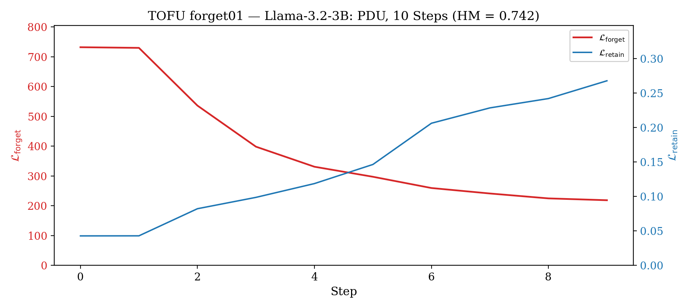 |

### TOFU forget05 — Llama-3.2-3B

| BLADE (HM = 0.849) | PDU (HM = 0.843) |
|---|---|
| 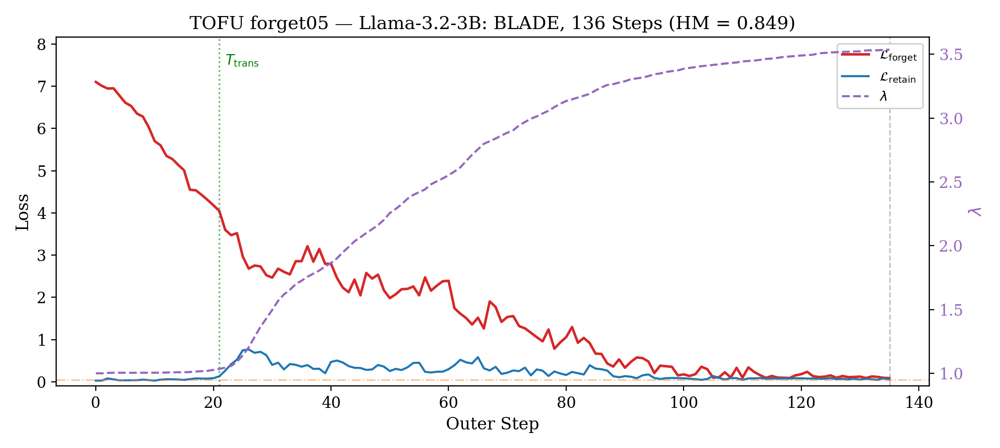 | 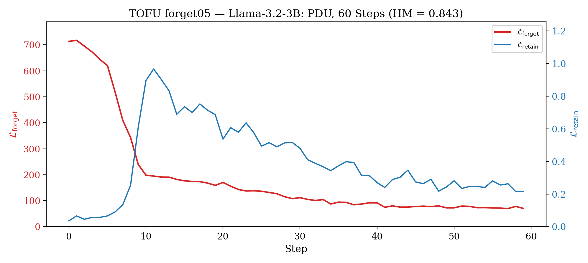 |

### TOFU forget10 — Llama-3.2-3B

| BLADE (HM = 0.842) | PDU (HM = 0.857) |
|---|---|
| 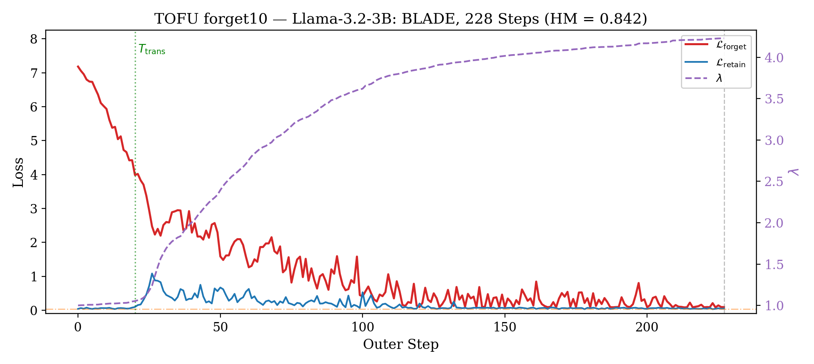 | 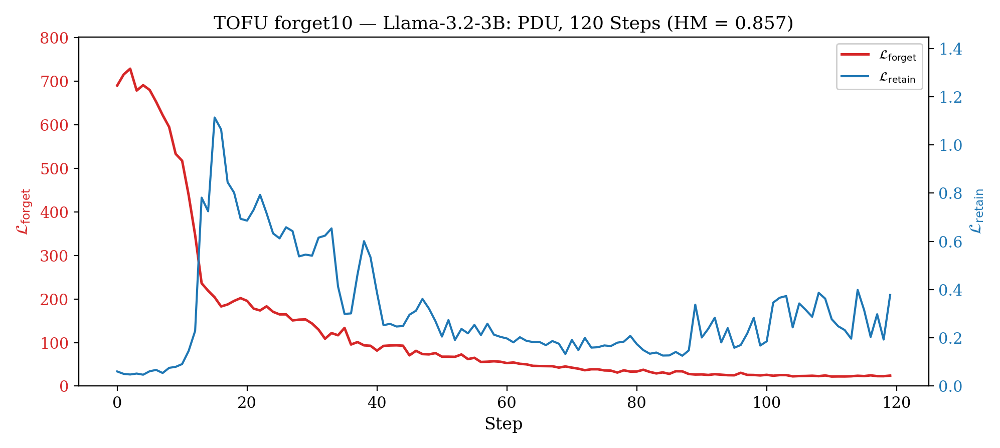 |

---

## Key Contributions

1. A constrained bilevel formulation for LLM unlearning that treats retain preservation as a hard constraint via augmented Lagrangian with a learned dual variable, replacing fragile fixed-weight loss balancing.
2. Clamped entropy: a bounded, self-stabilizing, reference-free forget objective where per-token gradients vanish once entropy exceeds a threshold, giving a natural stopping criterion without over-forgetting.
3. Comprehensive evaluation across multiple benchmarks (TOFU, MUSE), model scales (1B/3B/7B), forget regimes (1%–10%), and 5 seeds, plus an LLM judge protocol that exposes residual leakage missed by automated metrics.
4. Empirical analysis showing consistent three-phase convergence dynamics (warmup → spike-and-ratchet → convergence) across all settings, suggesting the ALM mechanism finds a universal operating point.

---

## Research Questions

- **RQ1 (Effectiveness):** Does our constrained bilevel formulation achieve superior forget–retain Pareto trade-offs compared to existing methods on established benchmarks?
- **RQ2 (Qualitative/Leakage):** Does automated metric superiority translate to genuine knowledge removal when probed by an LLM judge, or do baselines retain residual leakage invisible to standard metrics?
- **RQ3 (Robustness):** Does the method's advantage hold across model scales (1B→3B→7B), forget set sizes (1%→10%), and extended training (sustainability)?
- **RQ4 (Dynamics):** Does the ALM mechanism produce interpretable, predictable training dynamics — and what does each component (clamped loss, asymmetric update, bilevel structure) contribute?
- **RQ5 (Efficiency):** What is the computational overhead of the bilevel formulation compared to single-loop baselines, and does the reference-free loss offset the inner-loop cost?
