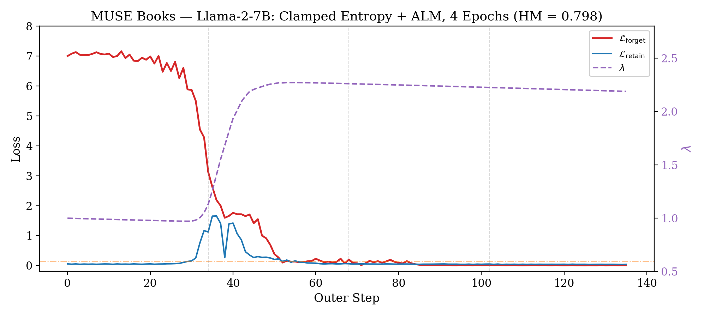
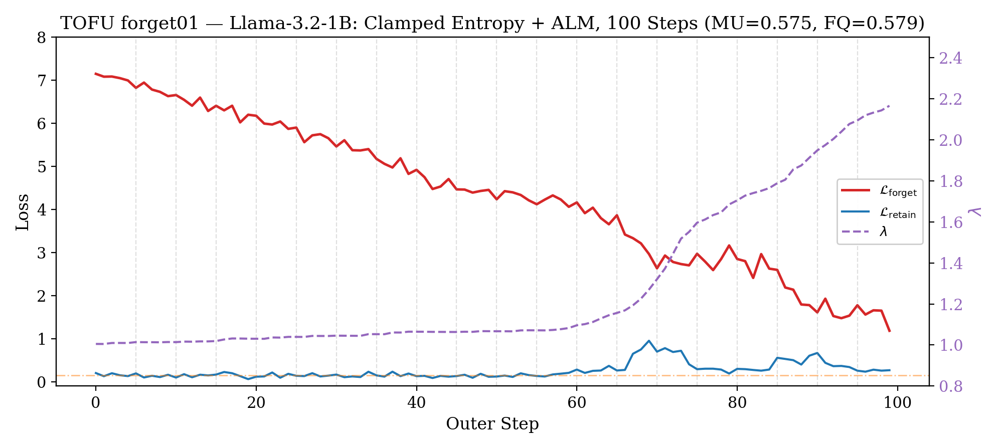
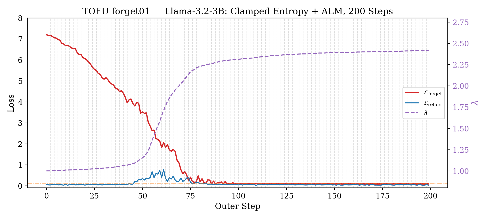

# LoRA-BiAL: Architecture & Evolution Report

**LoRA-based Bilevel Augmented Lagrangian for LLM Unlearning**

---

## 1. Base Components

LLM unlearning asks: *given a model that memorized data it shouldn't have, make it forget that data without destroying everything else it knows.* LoRA-BiAL treats this as a constrained optimization problem with four interlocking components.

### 1.1 LoRA Adapters

LoRA (Hu et al., 2022) freezes the original weights and adds small trainable low-rank matrices:

```
W_new = W_frozen + (α/r) · B × A

where W_frozen ∈ ℝ^{d_out × d_in},  B ∈ ℝ^{d_out × r},  A ∈ ℝ^{r × d_in},  r << min(d_out, d_in)
```

`d_out` and `d_in` are the output and input dimensions of the original weight (not always square — e.g., Llama-2-7B attention projections are 4096×4096 but `gate_proj` is 4096×11008). `r` is the rank bottleneck. The scaling factor `α/r` controls update magnitude; with `α=32`, `r=16` the effective scaling is 2×.

With `r=16` on a 7B model, ~0.08% of parameters are trainable. Two key properties for unlearning:

1. **Limits damage radius.** Changes are confined to a low-rank subspace — the model can't drift arbitrarily far from its original behavior.
2. **Free reference model.** Disable LoRA adapters → exact original model, zero overhead. Needed for reference-dependent losses like NPO.

**Why LoRA instead of sparse masking.** The original S-BiAL design (Oct 2023) restricted updates to a fixed binary mask `m ∈ {0,1}^d` chosen by magnitude pruning or SynFlow (Tanaka et al., 2020), with an L1/group-L2,1 regularizer on the active set. We moved to LoRA because: (a) mask selection happens before training but the right parameters to modify depend on the forget data — information unavailable at mask time; (b) sparse masking requires a separate reference model copy, while LoRA gets it for free; (c) LoRA integrates with PEFT/HuggingFace out of the box. The sparsity regularizer was also dropped — LoRA's low-rank constraint already limits degrees of freedom, and L1 on LoRA parameters provided no measurable benefit.

**Configuration:** LoRA on all projection matrices (`q/k/v/o_proj`, `gate/up/down_proj`), `r=16`, `α=32`.

### 1.2 Bilevel Optimization

Single-loop methods (GA, GradDiff, NPO) mix forget and retain signals in one gradient step. These objectives fight — whoever has the stronger gradient wins, and the other collapses.

Bilevel optimization separates them:

- **Inner loop:** K SGD steps minimizing retain CE. Fast, local repair after each outer perturbation.
- **Outer loop:** 1 Adam step minimizing forget loss subject to a retain constraint. The strategic move.

The **asymmetry of speed** is key: SGD at lr=2e-4 is fast and greedy on the smooth retain landscape; Adam at lr=3e-5 is slow and careful for forgetting. The inner loop gets K chances to repair retain damage before the next forget move.

### 1.3 Augmented Lagrangian Method (ALM)

The outer loop minimizes:

```
L_outer = L_forget + λ·(L_retain - ε) + (ρ/2)·max(0, L_retain - ε)²
```

| Term | Role |
|------|------|
| `L_forget` | Drives forgetting (always active) |
| `λ·(L_retain - ε)` | Linear penalty — λ grows when retain violates ε |
| `(ρ/2)·max(0, r)²` | Quadratic penalty — curvature near the constraint boundary |

**Why the quadratic term?** A pure dual-ascent (linear only) oscillates when the outer problem is nonconvex and coupled to a stochastic inner learner. The quadratic augmentation adds curvature, smoothing the landscape: *"λ provides direction, ρ provides curvature"* (Bertsekas, 1999; Nocedal & Wright, 2006). This allows convergence to feasibility with finite λ values. We increase ρ only when the residual stalls (Conn et al., 1991).

**Dual update (asymmetric):**

```
if L_retain > ε:     λ ← λ + ρ·(L_retain - ε)       # fast ratchet
else:                 λ ← λ + 0.1·ρ·(L_retain - ε)   # slow decay
```

The asymmetry encodes a core insight about unlearning stability. During forgetting, the outer loop pushes the model away from memorized data, which inevitably perturbs shared representations and temporarily degrades retain performance. With symmetric updates, λ drops back quickly once retain recovers — effectively erasing the system's memory that retain was recently in danger. The next aggressive forgetting step then triggers another spike, another λ ratchet, another recovery, creating oscillations.

With asymmetric updates, once a retain violation drives λ from 1.0 to 2.3, the slow decay means λ might only relax to ~2.1 over the remaining training. The outer objective permanently shifts: the `λ·(L_ret - ε)` term now weights retain ~2× higher than at initialization, so subsequent forgetting steps are gentler. The system learns the correct forget-retain tradeoff from the first spike and holds it, rather than rediscovering it every epoch.

**Setting ε (auto-epsilon).** Rather than hand-tuning an absolute threshold, ε is set as a multiplier on the model's initial retain loss. Before the training loop begins, we run one inner loop (K SGD steps on retain data) and average the per-step losses to get `L_ret_baseline`. Then:

```
ε = ε_mul · L_ret_baseline
```

For example, with `ε_mul = 0.85` and an initial retain loss of 0.18, we get `ε = 0.153`. This adapts automatically to the model and dataset — a model with higher baseline retain loss gets a proportionally larger threshold, so the constraint is always calibrated relative to the model's starting point rather than requiring manual tuning per benchmark.

### 1.4 Clamped Entropy Loss

A memorized model produces sharp, low-entropy next-token distributions on memorized sequences. Forgetting means spreading these distributions out — making the model uncertain about the next token on forget data.

**Setup.** Given an input sequence of T tokens, the model produces logits `z_t ∈ ℝ^V` at each position t, where V is the vocabulary size. The predictive distribution is `p_t = softmax(z_t)`, and its Shannon entropy is:

```
H(t) = -Σ_{v=1}^{V} p_t(v) · log p_t(v)
```

This ranges from 0 (all mass on one token — fully memorized) to `H_max = log(V)` (uniform distribution — maximally uncertain). For Llama-2-7B, V=32000 so `H_max ≈ 10.37`.

**Logit margin (our first attempt).** We first tried penalizing the gap between the top logit and the mean logit:

```
L_margin = (1/T) Σ_t [max_v(z_t(v)) - mean_v(z_t(v))]
```

This measures how peaked the logit vector is. Two problems:
- **Unbounded gradients:** A single highly confident token (where the top logit is far above the mean) produces an arbitrarily large per-token loss. The inner loop's K=3 SGD steps cannot repair the retain damage from one such gradient spike.
- **Operates on raw logits, not probabilities:** Logits are shift-invariant under softmax — adding a constant c to all logits changes the margin but not the distribution. This means logit margin penalizes the *scale* of logits rather than the *shape* of the distribution, which is what actually matters for memorization.

**Clamped entropy.** Instead, we target entropy directly and clamp per-token:

```
L_forget = (1/T) Σ_t max(0, τ·H_max - H(t))
```

Where:
- `T` = number of tokens in the sequence (positions where `attention_mask = 1`)
- `H(t)` = Shannon entropy of the model's output distribution at position t (defined above)
- `H_max = log(V)` = entropy of a uniform distribution over the vocabulary
- `τ ∈ (0, 1)` = target fraction of maximum entropy (we use `τ = 0.7`)
- `V` = vocabulary size (e.g., 32000 for Llama-2-7B, 128256 for Llama-3.2)

**Why the clamp matters.** The `max(0, ·)` term means: once token t reaches entropy ≥ τ·H_max (70% of uniform), its contribution to the loss is exactly zero and it produces zero gradient. This has three consequences:

1. **Bounded loss:** Each token contributes at most `τ·H_max` to the sum, so `L_forget ∈ [0, τ·H_max]`. No arbitrarily large gradients — the worst case is bounded. This is critical for the bilevel setup: the inner loop needs the outer perturbation to be predictably sized so K=3 steps suffice for repair.
2. **Self-stabilizing:** As forgetting succeeds, tokens progressively cross the τ·H_max threshold and drop out. The effective batch size of "active" tokens shrinks automatically. Early in training most tokens are active (low entropy on memorized data); late in training, only the stubbornest tokens remain. The gradient naturally decays without any explicit scheduling.
3. **Reference-free:** Only requires a forward pass through the current model. No base model logits needed (unlike NPO which needs reference logits from the frozen model). This halves the compute per outer step.

**Token-level example.** Consider the forget sequence `"Harry Potter is a wizard who attends Hogwarts"`. The loss is computed independently at each position. At the start of training (model still memorized):

| Position | Context | Model predicts | p(top) | H(t) | τ·H_max | per-token loss | Status |
|----------|---------|---------------|--------|------|---------|----------------|--------|
| 1 | "Harry" | "Potter" | 0.98 | 0.12 | 7.26 | 7.14 | Active — memorized |
| 3 | "is" | "a" | 0.15 | 6.80 | 7.26 | 0.46 | Active — mildly certain |
| 5 | "wizard" | "who" | 0.04 | 7.50 | 7.26 | 0.00 | Dropped out — already uncertain |

After 100 steps of training:

| Position | Context | p(top) | H(t) | per-token loss | Status |
|----------|---------|--------|------|----------------|--------|
| 1 | "Harry" | 0.06 | 7.40 | 0.00 | Dropped out — forgotten |
| 3 | "is" | 0.09 | 7.90 | 0.00 | Dropped out |
| 5 | "wizard" | 0.03 | 8.10 | 0.00 | Still out |

All tokens crossed the τ·H_max threshold — this sequence contributes zero gradient. The loss now focuses entirely on whatever sequences (or tokens within sequences) the model still remembers. Proper nouns and rare factual associations (e.g., specific dates, spell names) tend to be the last tokens to cross the threshold.

**Implementation** ([lora_bial_losses.py:45-56](src/trainer/unlearn/lora_bial_losses.py#L45-L56)):

```python
logits = model(input_ids, attention_mask).logits     # [B, T, V]
log_probs = F.log_softmax(logits, dim=-1)            # [B, T, V]
probs = log_probs.exp()                               # [B, T, V]
H = -(probs * log_probs).sum(dim=-1)                 # [B, T] — entropy per token
H_max = log(V)                                        # scalar
per_token_loss = clamp(τ·H_max - H, min=0)           # [B, T] — zero when H ≥ τ·H_max
loss = (per_token_loss * attention_mask).sum() / attention_mask.sum()
```

| Property | Clamped Entropy | Logit Margin | Grad Ascent | NPO |
|----------|----------------|--------------|-------------|-----|
| Bounded | Yes — [0, τ·H_max] | No | No | No |
| Self-stabilizing | Yes (tokens drop out) | No (always active) | No (positive feedback loop) | No |
| Reference-free | Yes | Yes | Yes | No |

### 1.5 Implicit Differentiation (Optional)

The outer gradient should account for how the inner loop's solution depends on outer parameters. We implement a truncated Neumann series with finite-difference HVP:

```
g_corrected = g_outer - H_outer · (H_inner + μI)^{-1} · g_outer
```

Safety mechanisms: probe-based step size, growth ratio cap (||g_corr|| > 10·||g||→ fallback), warmup, CPU offloading.

**Not used in current experiments** (`use_implicit: false`). With K=3 inner steps, the correction is small. Reserved for future experiments with larger K.

---

## 2. Pseudocode

```
Algorithm: LoRA-BiAL
━━━━━━━━━━━━━━━━━━━━━━━━━━━━━━━━━━━━━━━━━━━━━━━━━━━━━━━━━━━━

Input: target model M, forget set D_f, retain set D_r
Hyperparams: K, η_in, η_out, ε_mul, ρ, λ_init, τ

1. SETUP
   Apply LoRA adapters to M (r=16, α=32, all projections)
   θ ← trainable LoRA parameters
   inner_opt ← SGD(θ, lr=η_in)
   outer_opt ← Adam(θ, lr=η_out)
   λ ← λ_init

   ┌─── AUTO-EPSILON ──────────────────────────────────┐
   │  Run K inner SGD steps on retain, record losses   │
   │  ε ← ε_mul · mean(inner_losses)                  │
   └───────────────────────────────────────────────────┘

2. TRAINING LOOP (for t = 1, ..., T):

   ┌─── INNER LOOP ────────────────────────────────────┐
   │  for k = 1, ..., K:                               │
   │    b_r ~ D_r                                      │
   │    θ ← θ - η_in · ∇_θ CE(M(b_r))                │
   └───────────────────────────────────────────────────┘

   ┌─── OUTER STEP ────────────────────────────────────┐
   │  b_f ~ D_f,  b_r ~ D_r                           │
   │  L_fgt = ClampedEntropy(M(b_f), τ)               │
   │  L_ret = CE(M(b_r))                               │
   │  r = L_ret - ε                                    │
   │  g ← ∇_θ [L_fgt + λ·r + (ρ/2)·max(0,r)²]       │
   │  θ ← θ - η_out · Adam(g)                          │
   └───────────────────────────────────────────────────┘

   ┌─── DUAL UPDATE ───────────────────────────────────┐
   │  λ ← λ + ρ·r  (if r > 0)  or  λ + 0.1ρ·r       │
   │  λ ← clamp(λ, λ_min, λ_max)                     │
   └───────────────────────────────────────────────────┘

3. MERGE & SAVE: M_final = merge LoRA into base
```

---

## 3. Experiments

### 3.1 MUSE Books (Llama-2-7B)

**Task:** Unlearn Harry Potter book series. **Metric:** HM = harmonic mean of (1-forget_knowmem, 1-verbmem, retain_knowmem). **Target:** Beat SimNPO (HM=0.755).

**Base config:** LoRA r=16/α=32, K=3, η_in=2e-4, η_out=3e-5, ε=0.15, ρ=0.1, λ_init=1.0, bs=2, grad_accum=8 (eff_bs=16).

| ID | Loss | Key Change | fk↓ | vm↓ | rk↑ | HM↑ | Note |
|----|------|-----------|------|------|------|------|------|
| 01-10 | various | — | — | — | — | — | Invalid (implementation bugs) |
| 11 e1 | logit_margin | No ALM in gradient | 0.242 | 0.181 | 0.411 | 0.586 | Collapse by e3 |
| 12 e1 | logit_margin | ALM λ=0, ε=0.15 | 0.252 | 0.175 | 0.401 | 0.579 | ALM kicks in late |
| 12 e2 | logit_margin | ALM λ=0, ε=0.15 | 0.087 | 0.003 | 0.374 | 0.549 | |
| 13 e1 | logit_margin | ALM λ=1, ε=0.15 | 0.256 | 0.179 | 0.413 | 0.589 | Dampened spike |
| 13 e2 | logit_margin | ALM λ=1, ε=0.15 | 0.093 | 0.001 | 0.389 | 0.564 | |
| 14 e2 | focal_logit | ALM λ=1, γ=2 | 0.112 | 0.001 | 0.391 | 0.567 | Focal delays, same ceiling |
| 15 e2 | logit_margin | cosine lr, warmup=0.1 | 0.137 | 0.013 | 0.363 | 0.536 | Stable but slow forget |
| 16 e2 | repr_ortho | ALM λ=1, 2ep | 0.357 | 0.313 | 0.618 | 0.648 | No spike, weak forget |
| 17 e2 | clamped_ent | ALM λ=1, τ=0.7, 2ep | 0.096 | 0.001 | 0.443 | 0.687 | One spike then stable |
| **18 e4** | **clamped_ent** | **ALM λ=1, τ=0.7, 4ep** | **0.080** | **0.000** | **0.598** | **0.798** | **Beats SimNPO (0.755)** |

**Baselines:**

| Method | fk↓ | vm↓ | rk↑ | ex↓ | HM↑ |
|--------|------|------|------|------|------|
| Gold (retrain) | 0.303 | 0.145 | 0.687 | 0.011 | 0.739 |
| GradAscent | 0.000 | 0.000 | 0.000 | 0.008 | 0.000 |
| GradDiff | 0.000 | 0.000 | 0.025 | 0.008 | 0.070 |
| NPO | 0.411 | 0.570 | 0.661 | 0.377 | 0.542 |
| SimNPO | 0.239 | 0.005 | 0.604 | 0.009 | 0.755 |
| RMU | 0.308 | 0.120 | 0.604 | 0.011 | 0.708 |
| **LoRA-BiAL (ours)** | **0.080** | **0.000** | **0.598** | **0.008** | **0.798** |

### 3.2 TOFU forget01

**Task:** Forget 1% of TOFU QA pairs. **Metric:** HM = hmean(MU, 1-fgt_Prob, 1-fgt_ROUGE). **Config:** LoRA r=8/α=16, K=3, η_in=2e-4, η_out=2e-5, ε_mul=0.85, bs=4, grad_accum=4 (eff_bs=16).

**Llama-3.2-1B-Instruct:**

| Method | MU↑ | FQ↑ | ES↓ | fgt_Prob↓ | fgt_ROUGE↓ | HM↑ |
|--------|------|------|------|-----------|-----------|------|
| Gold (retrain) | 0.597 | 1.000 | 0.069 | 0.166 | 0.414 | 0.655 |
| GradAscent | 0.394 | 0.578 | 0.046 | 0.008 | 0.273 | 0.610 |
| GradDiff | 0.488 | 0.266 | 0.063 | 0.056 | 0.357 | 0.643 |
| NPO | 0.583 | 0.266 | 0.091 | 0.100 | 0.333 | 0.694 |
| RMU | 0.584 | 0.766 | 0.039 | 0.113 | 0.275 | 0.711 |
| PDU | 0.607 | 0.054 | 0.030 | 0.003 | 0.066 | **0.806** |
| LoRA-BiAL (ours, T=100) | 0.596 | 0.919 | 0.058 | 0.025 | 0.105 | 0.786 |
| LoRA-BiAL (ours, T=150) | 0.604 | 0.097 | 0.029 | 0.002 | 0.038 | **0.811** |

**Llama-3.2-3B-Instruct:**

| Method | MU↑ | FQ↑ | ES↓ | fgt_Prob↓ | fgt_ROUGE↓ | HM↑ |
|--------|------|------|------|-----------|-----------|------|
| Gold (retrain) | 0.663 | 1.000 | 0.067 | 0.179 | 0.409 | 0.656 |
| GradAscent | 0.607 | 0.990 | 0.105 | 0.070 | 0.335 | 0.710 |
| NPO | 0.655 | 0.766 | 0.116 | 0.133 | 0.365 | 0.705 |
| PDU | 0.703 | 0.001 | 0.029 | 0.004 | 0.075 | **0.855** |
| LoRA-BiAL (ours, T=100) | 0.662 | 0.001 | 0.029 | 0.000 | 0.012 | 0.852 |
| LoRA-BiAL (ours, T=150) | 0.649 | 0.029 | 0.029 | 0.000 | 0.022 | 0.842 |

---

## 4. Loss Dynamics

### 4.1 MUSE Books (Exp 18)



### 4.2 TOFU (Llama-3.2-1B)



### 4.3 TOFU (Llama-3.2-3B)



---

## 5. Key Observations

- **Logit margin family (Exps 11-15):** Strong forgetting but unbounded gradients cause retain spikes at every epoch boundary. Best HM capped at ~0.59.
- **Repr orthogonal (Exp 16):** Completely stable retain (no spikes) but weak forgetting — representation-space changes don't suppress output-level memorization. HM=0.648.
- **Clamped entropy (Exps 17-18):** Bounded and self-stabilizing. One spike, then smooth. 4 epochs beats SimNPO. HM=0.798.
- **More epochs help when ALM is working:** 2ep→4ep improved *both* forgetting (fk 0.096→0.080) and retain (rk 0.443→0.598). The elevated λ from the first spike protects retain while additional epochs push remaining tokens past the entropy clamp.
- **The spike is a feature, not a bug:** It calibrates λ to the correct level for the task. Without it (e.g., repr_orthogonal), λ decays monotonically and never reaches the level needed for strong retain protection during aggressive forgetting.

---

## References

- **Bertsekas, 1999.** D. P. Bertsekas. *Nonlinear Programming* (2nd ed.). Athena Scientific.
- **Conn et al., 1991.** A. R. Conn, N. I. M. Gould, Ph. L. Toint. A globally convergent augmented Lagrangian algorithm. *SIAM J. Numer. Anal.*, 28(2):545–572.
- **Hu et al., 2022.** E. J. Hu et al. LoRA: Low-Rank Adaptation of Large Language Models. *ICLR*.
- **Lorraine et al., 2020.** J. Lorraine, P. Vicol, D. Duvenaud. Optimizing millions of hyperparameters by implicit differentiation. *AISTATS*.
- **Nocedal & Wright, 2006.** J. Nocedal, S. J. Wright. *Numerical Optimization* (2nd ed.). Springer.
- **Tanaka et al., 2020.** H. Tanaka et al. Pruning neural networks without any data by iteratively conserving synaptic flow. *NeurIPS*.
