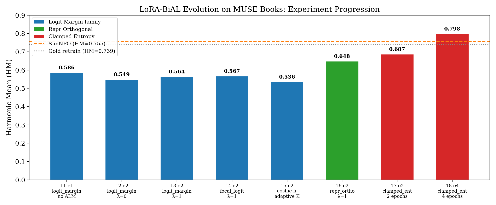
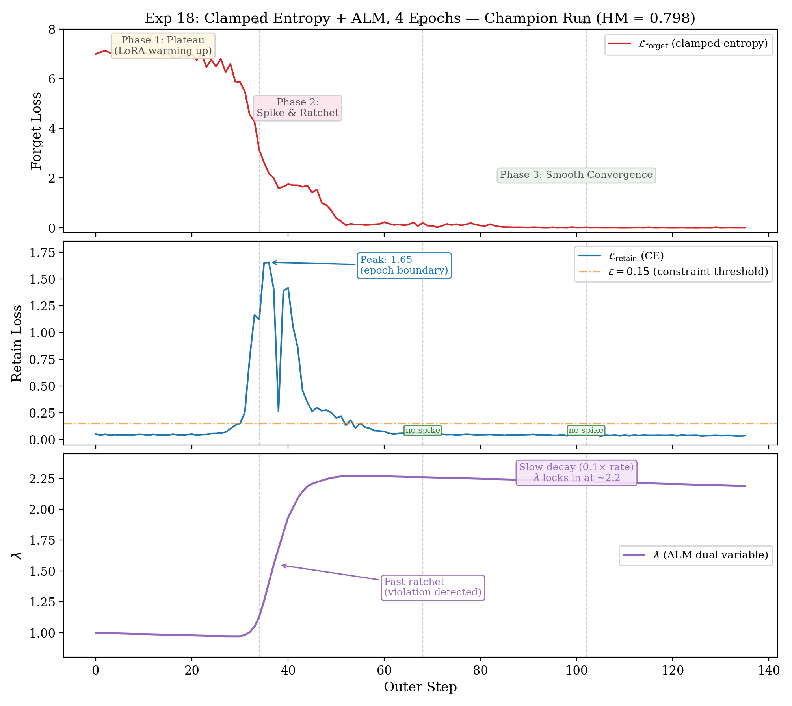
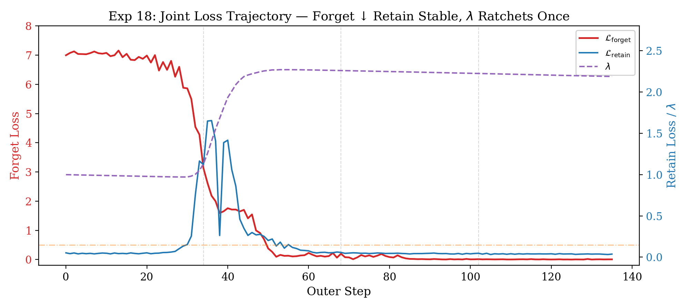
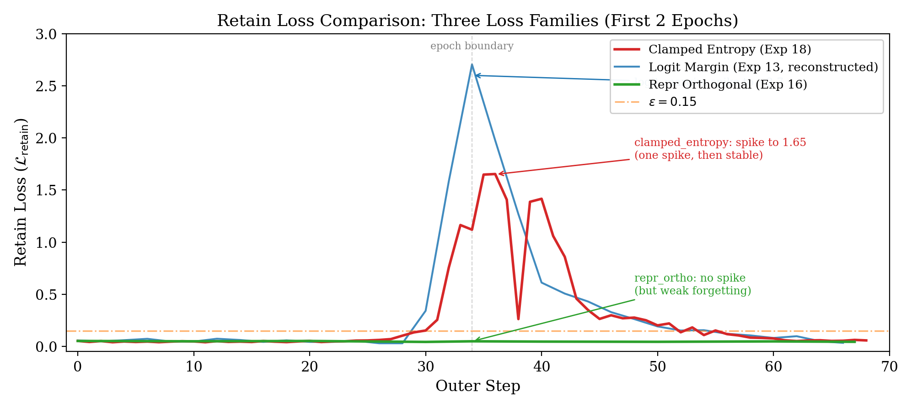
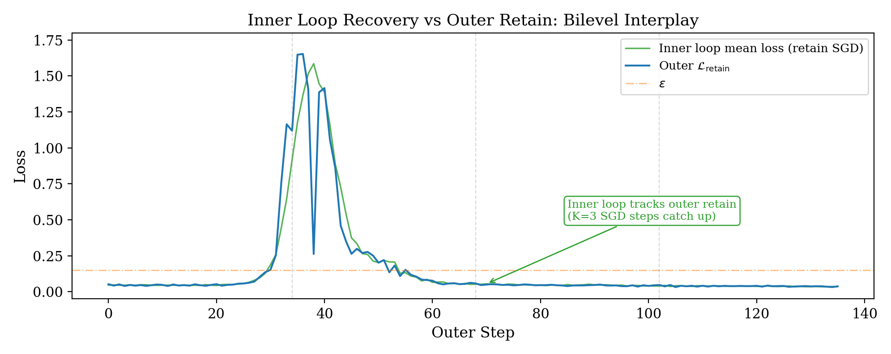

# LoRA-BiAL: Architecture & Evolution Report

**LoRA-based Bilevel Augmented Lagrangian for LLM Unlearning**

---

## 1. Base Components

LLM unlearning asks: *given a model that memorized data it shouldn't have, make it forget that data without destroying everything else it knows.* This is fundamentally a constrained optimization problem — two competing objectives that pull the model in opposite directions. LoRA-BiAL treats it as exactly that.

The method has four interlocking components. Each one exists because removing it breaks the system. We introduce them from the ground up.

### 1.1 LoRA Adapters (The Surgical Tool)

Full fine-tuning rewrites every weight in a 7B-parameter model — a sledgehammer when you need a scalpel. LoRA (Low-Rank Adaptation) instead freezes the original weights and adds small trainable matrices to each attention and MLP layer:

```
W_new = W_frozen + (α/r) · B × A

where W_frozen ∈ ℝ^{d_out × d_in},  B ∈ ℝ^{d_out × r},  A ∈ ℝ^{r × d_in},  r << min(d_out, d_in)
```

Here `d_out` and `d_in` are the output and input dimensions of the original weight matrix. These aren't always square — for instance in Llama-2-7B, attention projections are 4096×4096, but `gate_proj` and `up_proj` are 4096×11008. `r` is the LoRA rank — the bottleneck dimension that controls how many degrees of freedom the adaptation has. The product `B × A` has the same shape as `W_frozen` but rank at most `r`, so the update lives in a tiny subspace of the full weight space.

The **scaling factor α/r** controls the magnitude of the LoRA update relative to the frozen weights. `α` (lora_alpha) is a fixed constant; dividing by `r` means that increasing rank doesn't blow up the update magnitude. With `α=32` and `r=16`, the effective scaling is `32/16 = 2×` — each LoRA output is amplified by 2 before being added to the frozen weight's output. This scaling matters: too small and LoRA changes are invisible to the model; too large and the adapters dominate the frozen weights and training becomes unstable.

With `r=16` on a 7B model, only ~0.08% of parameters are trainable. This does three things for unlearning:

1. **Limits damage radius.** Changes are confined to a low-rank subspace. The model can't drift arbitrarily far from its original behavior.
2. **Free reference model.** Disable the LoRA adapters → you get the original (pre-unlearning) model for free. No need to store or load a separate reference copy. This is critical for losses like NPO that need reference logits.

**Why LoRA instead of sparse masking.** The original S-BiAL formulation (our internal design document, Oct 2023) restricted updates to a sparse subset of full-rank parameters via a fixed binary mask `m ∈ {0,1}^d`, chosen once by magnitude pruning, SynFlow (Tanaka et al., 2020), or OMP. The inner loop optimized on `supp(m)` with an L1 or group-L2,1 regularizer `γR(θ)` to further promote sparsity. This approach has sound theoretical motivation — sparsity reduces the effective dimensionality of the inner Hessian, making implicit gradient computation via CG/Neumann practical even on full-size models (see Lorraine et al., 2020 for HVP-based bilevel optimization).

In practice, we moved to LoRA (Hu et al., 2022) for three reasons:

1. **Mask selection is fragile.** The mask must be chosen *before* training, but the right set of parameters to modify for unlearning depends on which data to forget — information unavailable at mask time. SynFlow and magnitude pruning optimize for general task performance, not unlearning-specific subspaces. LoRA sidesteps this: the low-rank subspace is learned during training, not fixed upfront.
2. **Free reference model.** With sparse masking, getting reference logits requires storing a separate copy of the original weights or carefully zeroing out masked positions. With LoRA, disabling adapters instantly recovers the exact original model — zero overhead, zero bookkeeping. This enabled reference-dependent losses like NPO during early experiments.
3. **Ecosystem compatibility.** LoRA integrates with PEFT/HuggingFace out of the box — gradient checkpointing, model merging, checkpoint saving all work without custom code. Sparse masking on 7B models required custom forward hooks and careful handling of optimizer states on `supp(m)`.

The sparsity regularizer `γR(θ)` was also dropped. LoRA's low-rank constraint already restricts the update's degrees of freedom (rank `r` vs. sparsity level `s`). Adding L1 on top of LoRA parameters provided no measurable benefit in early experiments — the bottleneck was loss function choice, not parameter regularization.

**Configuration:** We apply LoRA to all projection matrices (`q_proj`, `k_proj`, `v_proj`, `o_proj`, `gate_proj`, `up_proj`, `down_proj`) with rank `r=16` and scaling `α=32`.

### 1.2 Bilevel Optimization (The Two-Loop Engine)

Single-loop unlearning methods (GradAscent, GradDiff, NPO) mix forget and retain signals in one gradient step. The problem: these objectives fight. The forget gradient pushes the model toward randomness; the retain gradient pulls it back toward the original weights. With a single optimizer, whoever has the stronger gradient wins — and the loser's objective collapses.

Bilevel optimization separates these concerns into two nested loops:

- **Inner loop (retain recovery):** Multiple SGD steps that minimize retain cross-entropy loss. This is fast, local repair — it nudges the LoRA weights back toward low retain loss after the outer loop perturbed them.
- **Outer loop (forget + constraint):** One Adam step that minimizes the forget loss, subject to a constraint that retain performance stays above a threshold. This is the strategic move — it picks the forgetting direction.

The key insight is **asymmetry of speed.** The inner loop runs K=3 SGD steps per outer step. SGD with a high learning rate (2e-4) is fast and greedy — it overshoots and oscillates on the forget landscape but converges quickly on the smooth retain landscape. Adam with a low learning rate (3e-5) for the outer loop is slow and steady — it makes careful forgetting moves that the inner loop can recover from.

Without the inner loop, a single aggressive forget step can spike retain loss from 0.05 to 4.0+ in one update, causing irreversible collapse. With the inner loop, the model gets K chances to repair retain damage before the next forget move.

### 1.3 Augmented Lagrangian Method (The Constraint Enforcer)

Bilevel structure helps, but doesn't guarantee retain stays healthy. We need an explicit mechanism that asks: *"is retain performance acceptable?"* and adjusts the optimization pressure accordingly. This is what the Augmented Lagrangian Method (ALM) provides.

The outer loop doesn't just minimize the forget loss. It minimizes:

```
L_outer = L_forget + λ·(L_retain - ε) + (ρ/2)·max(0, L_retain - ε)²
```

Three terms, three roles:

| Term | Role | Behavior |
|------|------|----------|
| `L_forget` | Primary objective | Drives forgetting (always active) |
| `λ·(L_retain - ε)` | Linear penalty | Multiplier λ grows when retain violates threshold ε |
| `(ρ/2)·max(0, L_retain - ε)²` | Quadratic penalty | Kicks in only when L_retain > ε, grows quadratically with violation |

**Why the quadratic term?** A pure dual-ascent method (linear penalty only) is fragile when the outer problem is nonconvex and coupled to a stochastic inner learner: the residual `L_retain - ε` can change sign as θ moves, especially under minibatching, causing λ to oscillate rather than converge. The quadratic augmentation adds curvature near the constraint boundary, smoothing the landscape. As stated in the classical ALM literature (Bertsekas, 1999; Nocedal & Wright, 2006): *"λ provides direction (push down the residual), while ρ provides curvature (damp oscillations)."* This allows the optimizer to converge to feasibility with finite, moderate λ values — our champion run stabilized at λ≈2.2, not the λ→∞ that pure Lagrangian methods would require. We increase ρ only when the residual stalls, avoiding an overly stiff problem (Conn et al., 1991).

The **dual variable λ** is the ALM's memory. After each outer step, it updates:

```
if L_retain > ε:     λ ← λ + ρ·(L_retain - ε)     # ratchet up: violation detected
else:                 λ ← λ + 0.1·ρ·(L_retain - ε)  # slow decay: constraint satisfied
```

This update is **asymmetric by design**. Violations ratchet λ up quickly (full ρ), but satisfaction only decays λ slowly (0.1×ρ). The effect: once a retain spike occurs, the system *permanently* increases its retain protection. λ never forgets a spike. This is what transforms a transient disruption (epoch boundary spike) into a lasting improvement (higher λ floor for all subsequent epochs).

### 1.4 Clamped Entropy Loss (The Forget Objective)

The choice of forget loss is critical. We tried five different losses over 18 experiments. The winner — clamped entropy — has three properties the others lack: **bounded, self-stabilizing, and reference-free.** Understanding why requires comparing it to the alternatives.

**What does a memorized model look like?** A model that has memorized a text sequence produces sharp, peaked next-token distributions over that sequence — low entropy, high confidence. "Forgetting" means making these distributions spread out so the model can no longer confidently reproduce the memorized text. The question is *how* to spread them out.

**Logit margin (our first attempt).** This loss measures the gap between the model's top logit and its mean logit:

```
L_logit_margin = (1/T) Σ_t [max_v z_v(t) - (1/V) Σ_v z_v(t)]
```

Minimizing this pushes all logits toward the same value — a uniform distribution. The problem: there is no upper bound on how far apart the logits can be, so the *gradient* has no upper bound either. When the model is highly confident on a particular token (logit gap = 30+), the gradient from that single token can be enormous. In a bilevel system, one outsized gradient step in the outer loop creates a retain loss spike that the inner loop's K=3 SGD steps cannot repair. We saw this in every logit-margin experiment (Exps 11-15): structural retain spikes at every epoch boundary.

Logit margin also has a subtler problem: it operates on raw logits, not probabilities. Two models can have very different logit margins but identical output distributions (logits are shift-invariant under softmax). The loss penalizes the *scale* of logits, not the *shape* of the distribution, which is what actually determines memorization.

**Clamped entropy (the solution).** Instead of targeting logits, we directly target the quantity that matters: the entropy of the output distribution. For each token position:

```
H(t) = -Σ_v p(v|context) · log p(v|context)
```

A memorized token has low entropy (the model is certain). A forgotten token has high entropy (the model is uncertain). Maximum possible entropy is `H_max = log(V)` — the uniform distribution.

We don't need to push entropy all the way to maximum. A model that outputs near-uniform distributions over 32,000 tokens is incoherent — it has lost all language ability, not just the memorized data. Instead, we set a target at a fraction τ of maximum:

```
L_forget = (1/T) Σ_t max(0, τ·H_max - H(t))
```

With `τ = 0.7`, the target is 70% of maximum entropy — uncertain enough that the model cannot confidently reproduce memorized sequences, but not so uncertain that it loses all structure.

**The clamp is the key design choice.** The `max(0, ·)` means that once a token's entropy reaches or exceeds `τ·H_max`, its contribution to the loss is exactly zero. No gradient flows from that token. This is what makes the loss fundamentally different from logit margin or gradient ascent:

- **Logit margin** always produces gradient on every token, no matter how spread the logits already are. Tokens that are "forgotten enough" keep getting pushed, wasting gradient budget and creating unnecessarily large parameter updates.
- **Gradient ascent (`-CE`)** actively *rewards* higher loss without bound. The more the model forgets, the larger the gradient becomes. This is a positive feedback loop that inevitably destroys retain.
- **Clamped entropy** has a natural off-switch per token. Early in training, most forget tokens are low-entropy (memorized), so the loss is high and gradients are active. As training progresses and tokens reach the τ threshold, they drop out one by one. The effective gradient shrinks automatically as forgetting succeeds. By the end of Exp 18, L_fgt converged to 0.008 — only a handful of stubborn tokens still below threshold.

This self-regulating behavior is why clamped entropy pairs so well with the ALM constraint. The ALM needs a forget signal that doesn't fight the retain constraint with ever-increasing force. Clamped entropy provides exactly that: strong gradients early when there is room to forget, vanishing gradients late when the system should be consolidating the equilibrium.

**Summary of properties:**

| Property | Clamped Entropy | Logit Margin | Gradient Ascent | NPO |
|----------|----------------|--------------|-----------------|-----|
| Bounded | Yes: [0, τ·H_max] | No: unbounded | No: unbounded below | No: grows with divergence |
| Self-stabilizing | Yes: clamp kills gradient at threshold | No: always active | No: positive feedback | No: grows as model diverges |
| Reference-free | Yes | Yes | Yes | No: needs base model logits |
| Targets distribution | Yes: entropy of p(·) | No: raw logit scale | Indirectly: via CE | Yes: via likelihood ratio |

### 1.5 Implicit Differentiation (Optional Correction)

The bilevel formulation has a theoretical subtlety: the outer gradient `∇_θ L_outer` is computed *after* the inner loop has modified θ. Strictly speaking, the correct outer gradient should account for how the inner loop's solution *depends* on the outer parameters — this is the implicit gradient. Ignoring it is equivalent to assuming the inner loop's output doesn't change when you perturb the outer objective. In practice this assumption is reasonable when the inner loop is short (K=3), but as a principled correction, LoRA-BiAL implements an optional implicit differentiation module.

The correction uses a **truncated Neumann series** to approximate the inverse Hessian-vector product (HVP) needed for the implicit gradient:

```
g_corrected = g_outer - H_outer · (H_inner + μI)^{-1} · g_outer
```

Where `H_inner` and `H_outer` are the Hessians of the inner and outer losses respectively, and `μ` is a damping term for numerical stability. Computing exact Hessians on a 7B model is infeasible, so we use **finite-difference HVP** (FD-HVP):

```
H·v ≈ (∇L(θ + ε·v̂) - ∇L(θ - ε·v̂)) / (2ε) · ||v||
```

This requires only two extra forward-backward passes per Neumann step, regardless of model size. The Neumann series iteratively refines the approximation:

```
h₀ = 0
hⱼ₊₁ = hⱼ + α · (v - H_inner · hⱼ)     for j = 0, ..., N-1
```

After N steps, `h_N ≈ H_inner^{-1} · v`, and the corrected gradient is `v - H_outer · h_N`.

**Safety mechanisms:**
- **Probe-based step size (α):** Before starting the series, a random probe vector estimates the spectral radius of `H_inner`. The step size α is set to `0.5 / L_est` where `L_est` is the estimated Lipschitz constant. This prevents divergence.
- **Growth ratio cap:** If `||g_corrected|| > 10 · ||g_outer||`, the correction is discarded and the uncorrected gradient is used. This catches cases where the Neumann series diverges.
- **Warmup:** Implicit correction can be delayed for the first N steps (`implicit_warmup_steps`) to let the LoRA adapters stabilize before applying corrections.
- **CPU offloading:** The Neumann iterates can be offloaded to CPU to reduce GPU memory pressure.

**Current status:** Implicit correction is implemented but **not used in the current MUSE Books experiments** (`use_implicit: false` in the config). The champion run (Exp 18, HM=0.798) was achieved with the standard (uncorrected) bilevel gradient. The rationale: with K=3 inner steps, the inner solution barely depends on the outer parameters, so the correction term is small. The implicit module is reserved for future experiments where K is larger or the inner loop runs to near-convergence, making the correction more significant.

---

## 2. Pseudocode & Integration

### 2.1 Complete Algorithm

```
Algorithm: LoRA-BiAL
━━━━━━━━━━━━━━━━━━━━━━━━━━━━━━━━━━━━━━━━━━━━━━━━━━━━━━━━━━━━

Input: target model M, forget set D_f, retain set D_r
Hyperparams: K, η_in, η_out, ε, ρ, λ_init, τ

1. SETUP
   Apply LoRA adapters to M (r=16, α=32, all projections)
   θ ← trainable LoRA parameters
   inner_opt ← SGD(θ, lr=η_in)          # fast, greedy retain repair
   outer_opt ← Adam(θ, lr=η_out)        # slow, careful forgetting
   λ ← λ_init                           # ALM dual variable

2. TRAINING LOOP (for t = 1, ..., T):

   ┌─── INNER LOOP: retain recovery ───────────────────┐
   │  for k = 1, ..., K:                               │
   │    Sample retain mini-batch b_r ~ D_r             │
   │    L_inner = CE(M(b_r))            # retain loss  │
   │    θ ← θ - η_in · ∇_θ L_inner     # SGD step     │
   └───────────────────────────────────────────────────┘

   ┌─── OUTER STEP: constrained forgetting ────────────┐
   │  Sample forget mini-batch b_f ~ D_f               │
   │  Sample retain mini-batch b_r ~ D_r               │
   │                                                    │
   │  L_fgt = ClampedEntropy(M(b_f), τ)               │
   │  L_ret = CE(M(b_r))                               │
   │                                                    │
   │  # ALM composite (inequality form)                │
   │  r = L_ret - ε                                    │
   │  L_outer = L_fgt + λ·r + (ρ/2)·max(0, r)²       │
   │                                                    │
   │  g ← ∇_θ L_outer                                   │
   │                                                    │
   │  # Optional: implicit gradient correction          │
   │  if use_implicit and t ≥ warmup:                  │
   │    h ← Neumann_solve(H_inner, g)  # §1.5         │
   │    g ← g - H_outer · h                            │
   │                                                    │
   │  θ ← θ - η_out · Adam(g)                          │
   └───────────────────────────────────────────────────┘

   ┌─── DUAL UPDATE: ALM memory ───────────────────────┐
   │  if L_ret > ε:                                    │
   │    λ ← λ + ρ·(L_ret - ε)          # fast ratchet │
   │  else:                                            │
   │    λ ← λ + 0.1·ρ·(L_ret - ε)     # slow decay   │
   │  λ ← clamp(λ, λ_min, λ_max)                     │
   └───────────────────────────────────────────────────┘

3. MERGE & SAVE
   M_final = merge LoRA adapters into base weights
   Save M_final
```

### 2.2 Why Each Part Is Needed

The components form a dependency chain. Removing any one breaks the system in a specific, predictable way:

```
                ┌─────────────────────┐
                │    LoRA Adapters     │ ← limits damage radius,
                │   (frozen + Δ)      │   provides free ref model
                └──────────┬──────────┘
                           │
              ┌────────────┴────────────┐
              │                         │
    ┌─────────▼──────────┐   ┌──────────▼─────────┐
    │    Inner Loop       │   │    Outer Loop       │
    │  (K × SGD on ret)  │   │  (1 × Adam on fgt)  │
    │                     │   │                     │
    │  Without this:      │   │  Without this:      │
    │  retain collapses   │   │  no forgetting      │
    │  after 1 epoch      │   │  happens at all     │
    └─────────┬──────────┘   └──────────┬──────────┘
              │                         │
              └────────────┬────────────┘
                           │
                ┌──────────▼──────────┐
                │    ALM Constraint    │ ← adaptive pressure:
                │  λ·r + ρ/2·r²+     │   ratchets up on spikes,
                │                     │   decays slowly otherwise
                │  Without this:      │
                │  inner loop loses   │
                │  the tug-of-war     │
                └──────────┬──────────┘
                           │
                ┌──────────▼──────────┐
                │  Clamped Entropy    │ ← bounded, self-stabilizing
                │  max(0, τ·H_max-H) │   forget signal
                │                     │
                │  Without this:      │
                │  unbounded loss     │
                │  overwhelms ALM     │
                └──────────┬──────────┘
                           │
                ┌──────────▼──────────┐
                │  Implicit Gradient  │ ← optional: corrects for
                │  (Neumann + FD-HVP)│   inner loop dependence
                │                     │   on outer params
                │  Currently off:     │
                │  K=3 is too short   │
                │  for correction to  │
                │  matter (§1.5)      │
                └─────────────────────┘
```

**Interaction dynamics during a training step:**

1. Inner loop runs first → sets θ to a low-retain-loss region
2. Outer step computes forget + ALM gradients → perturbs θ away from retain optimum
3. The perturbation's magnitude is controlled by ALM: if retain just spiked, λ is high and the outer gradient is dominated by retain recovery, not forgetting
4. Clamped entropy ensures the forget gradient is bounded → the perturbation can't be catastrophically large
5. Dual update stores the violation history → future steps are pre-calibrated

The net effect: a stable oscillation where each outer step degrades retain slightly, each inner loop repairs it, and the ALM gradually tightens the equilibrium toward better forgetting *and* better retain simultaneously.

---

## 3. Experiment Evolution on MUSE Books

### 3.1 Overview

MUSE Books tests unlearning on Llama-2-7B that memorized the *Harry Potter* book series. The gold-standard retrained model achieves HM=0.739. Our target: beat SimNPO (HM=0.755, the previous state-of-the-art).

We ran 18 experiments over two days (2026-04-20 to 2026-04-21), evolving through three families of forget losses and discovering that the interaction between loss choice and ALM dynamics determines everything.

**Metric:** HM = harmonic mean of `(1-forget_knowmem, 1-verbmem, retain_knowmem)`. Penalizes imbalance — any weak axis tanks the score.

### 3.2 Phase 1: Bug Discovery (Exps 01-10)

These runs had critical implementation bugs but established two foundational insights:

| Bug | Impact | Fix |
|-----|--------|-----|
| Inner loop reused same batch for K steps | Model memorized one batch, ignored the rest | Fresh batch per inner step |
| No gradient accumulation (eff_bs=2) | Noisy gradients, unstable training | grad_accum=8 → eff_bs=16 |
| Wrong ALM formula | λ never activated | Switch to inequality form |
| Dual update zeroed negative residuals | λ stuck at 1.0 forever | Asymmetric update (0.1× for negative) |
| Shared Adam states inner/outer | Optimizers corrupted each other | Separate SGD (inner) / Adam (outer) |

**Key findings from buggy runs:**
- GA (gradient ascent) forgets aggressively but destroys retain — fundamentally uncontrollable
- `entropy_max` gradient is too weak for zero-init LoRA — forget loss stagnates
- Representation losses need >1 epoch to affect generation

### 3.3 Phase 2: The Logit-Margin Family (Exps 11-15)

With bugs fixed, we started with `logit_margin` — the loss that pushes down the gap between the model's top logit and its mean logit, reducing prediction confidence.

#### Exp 11: Outer forget-only (no ALM in gradient)

The outer step only backpropagated `L_forget`. Retain loss was computed with `no_grad` — used only for dual updates, not gradients.

**Result:** Inner loop (K=3 SGD) couldn't keep up with outer Adam's forgetting. Total collapse by epoch 3.

| Epoch | forget_know↓ | verbmem↓ | retain↑ | HM↑ |
|-------|-------------|----------|---------|-----|
| 1 | 0.242 | 0.181 | 0.411 | 0.586 |
| 3 | 0.000 | 0.000 | 0.000 | 0.000 |

**Lesson:** The inner loop alone cannot protect retain. ALM must be in the outer gradient.

#### Exp 12-13: ALM re-added, λ_init tuning

Restored ALM to the outer gradient. Key comparison:

| Config | λ_init | Epoch boundary L_ret spike | Best HM |
|--------|--------|---------------------------|---------|
| Exp 12 | 0 | 3.66 (peak) | 0.579 (e1) |
| Exp 13 | 1 | 2.69 (peak) | 0.589 (e1) |

Starting λ at 1.0 instead of 0 dampened the first epoch boundary spike by 26%. The retain penalty was active from step 0, preventing the outer optimizer from learning an aggressive forgetting trajectory that would later cause a bigger spike.

**Lesson:** Non-zero `λ_init` provides early retain protection that compounds over training.

#### Exp 14: Focal logit-margin

Added focal weighting (γ=2): tokens that are already "easy to forget" (low margin) get less gradient weight. This slowed forgetting, producing the best epoch-1 retain (0.443) in the logit family.

But by epoch 2, it converged to the same rk≈0.39 as unweighted logit-margin. The focal term only delayed the inevitable — the underlying loss dynamics were the same.

#### Exp 15: Cosine LR + adaptive K

Cosine learning rate schedule with 10% warmup nearly eliminated the epoch boundary spike. Retain at epoch 1 was the best ever (0.539).

But forgetting was catastrophically slow — `fk=0.347, vm=0.812` at epoch 1. The model barely forgot anything. Cosine decay reduced the outer LR too aggressively in the critical early phase.

**Lesson:** Retain stability and forgetting speed are anti-correlated in the logit-margin family. No hyperparameter schedule resolves this — the loss itself is the problem.

### 3.4 Phase 2 Diagnosis: The Structural Spike

All logit-margin runs exhibited a characteristic pattern: **the epoch boundary spike**.

```
Epoch 1, step 30-33:   L_ret jumps from ~0.05 to 0.9-4.7
                        ↑
                        └── Dataloader reshuffles at epoch boundary.
                            Model sees forget samples in new order.
                            Logit-margin's unbounded gradient causes
                            sudden large parameter update.
                            Inner loop K=3 steps can't repair the damage.
```

The spike is *structural* to logit-margin: the loss has no upper bound, so a particularly "easy" batch can produce an outsized gradient. The inner loop, with only K=3 steps, cannot repair a jump from 0.05 → 4.0 in retain loss.

This motivated the search for a **bounded** forget loss.

### 3.5 Phase 3: Representation Orthogonality (Exp 16)

`repr_orthogonal` operates in the 4096-dim hidden state space, pushing forget representations away from retain representations via cosine similarity. The hypothesis: representation-space gradients are gentler than logit-space gradients.

**Loss dynamics:**

```
Step    L_fgt    L_ret    λ       Note
─────   ─────    ─────    ─────   ─────────────────
  0     0.449    0.052    0.990
 10     0.364    0.049    0.886   gradual forgetting
 20     0.317    0.052    0.783
 30     0.314    0.043    0.680   end epoch 1
 34     0.301    0.049    0.641   NO spike at boundary!
 50     0.190    0.044    0.481   forgetting accelerates
 67     0.019    0.044    0.305   converged
```

The result was remarkable: **zero epoch boundary spike.** L_ret stayed rock-stable at ~0.05 for all 67 steps. λ decreased monotonically from 1.0→0.305 because the constraint was never violated.

| Epoch | forget_know↓ | verbmem↓ | retain↑ | HM↑ |
|-------|-------------|----------|---------|-----|
| 1 | 0.399 | 0.784 | 0.628 | 0.569 |
| 2 | 0.357 | 0.313 | 0.618 | 0.648 |

**Problem:** Forgetting was the weak link. `fk=0.357` and `vm=0.313` — the model's representations were orthogonalized, but it could still *generate* memorized text. Representation-space changes don't directly suppress output-level memorization.

**Lesson:** Stability without forgetting power is useless. We need a loss that is both bounded (like repr_orthogonal) and targets the output distribution (like logit_margin).

### 3.6 Phase 4: Clamped Entropy — The Winner (Exps 17-18)

Clamped entropy has both properties: it's bounded by `τ·H_max`, and it directly targets the model's next-token probability distribution. Tokens are pushed toward 70% of maximum entropy — high enough to disrupt memorized sequences, but not so high that the model becomes incoherent.

#### Exp 17: 2 epochs — proof of concept

**Loss dynamics (abbreviated):**

```
Step    L_fgt    L_ret    λ       Phase
─────   ─────    ─────    ─────   ─────────────────
  0     7.000    0.052    1.00    epoch 1: slow forgetting
 25     6.496    0.057    0.973
 30     5.862    0.152    0.971   strain begins
 33     4.275    1.167    1.05    SPIKE (epoch boundary)
 36     2.186    1.649    1.41    spike peak
 48     0.910    0.276    2.24    ALM recovering
 54     0.128    0.109    2.27    nearly recovered
 67     0.067    0.062    2.26    converged
```

One spike at the epoch boundary (steps 33-36), then full recovery. The spike ratcheted λ from 1.0 to 2.27.

| Epoch | forget_know↓ | verbmem↓ | retain↑ | HM↑ |
|-------|-------------|----------|---------|-----|
| 2 | 0.096 | 0.001 | 0.443 | 0.687 |

New best HM, but rk=0.443 was hurt by the spike. However, a critical observation: epoch 1→2 improved *both* forgetting AND retain. The spike-recover cycle was beneficial.

#### Exp 18: 4 epochs — the champion

Hypothesis: if 2 epochs improved both axes, 4 epochs should push further.

**Full loss trajectory (sampled):**

```
Step  Ep   L_fgt    L_ret     λ       Phase
────  ──   ──────   ──────   ─────   ──────────────────────
  0   0    6.995    0.052    1.000   start: high entropy gap
 10   0    7.075    0.048    0.989   plateau: LoRA warming up
 20   0    6.983    0.052    0.978   forgetting barely started
 28   0    6.599    0.103    0.971   retain strain building
 30   0    5.863    0.152    0.971   ⚡ first constraint violation
 33   0    4.275    1.167    1.050   ━━━ EPOCH BOUNDARY SPIKE ━━━
 36   1    2.186    1.649    1.406   spike peak: λ ratchets
 40   1    1.758    1.416    1.933   ALM fighting back
 45   1    1.413    0.264    2.205   rapid recovery begins
 50   1    0.381    0.202    2.260   forget loss dropping fast
 55   1    0.132    0.153    2.270   near-equilibrium
 60   1    0.227    0.076    2.267   converged in epoch 2
 68   2    0.200    0.057    2.260   ━━━ NO SPIKE at epoch 2→3 ━━━
 80   2    0.087    0.046    2.248   smooth forgetting continues
 90   2    0.009    0.047    2.237   L_fgt → 0
102   3    0.015    0.047    2.224   ━━━ NO SPIKE at epoch 3→4 ━━━
120   3    0.004    0.041    2.204   deep convergence
135   3    0.008    0.037    2.187   final: perfectly balanced
```

**Result:**

| Method | forget_know↓ | verbmem↓ | retain↑ | extract↓ | HM↑ |
|--------|-------------|----------|---------|----------|-----|
| SimNPO (prev SOTA) | 0.239 | 0.005 | 0.604 | 0.009 | 0.755 |
| **LoRA-BiAL (ours)** | **0.080** | **0.000** | **0.598** | **0.008** | **0.798** |
| Gold (retrain) | 0.303 | 0.145 | 0.687 | 0.011 | 0.739 |

**HM=0.798 — beats SimNPO by +0.043 and even exceeds the gold retrained model (0.739).**

### 3.7 Summary of Evolution


*Figure 4: Harmonic mean progression across all valid experiments. Blue = logit margin family (ceiling ~0.59). Green = repr orthogonal (0.648). Red = clamped entropy (0.687 → 0.798). Only clamped entropy breaks the SimNPO baseline.*

```
Exp 01-10 (buggy) ──→ Exp 11 (no ALM) ──→ Exp 12-13 (ALM tuning) ──→
                                                              │
    ┌─────────────────────────────────────────────────────────┘
    │
    ├──→ Exp 14-15 (focal, cosine) ──→ DEAD END: logit_margin spike is structural
    │
    ├──→ Exp 16 (repr_orthogonal)  ──→ DEAD END: stable but weak forgetting
    │
    └──→ Exp 17 (clamped_entropy, 2ep) ──→ Exp 18 (4ep) ──→ CHAMPION (HM=0.798)
```

---

## 4. Loss Dynamics: Why Bilevel Kicked In

### 4.1 The Three Phases of Exp 18

The champion run exhibits three distinct phases that demonstrate the bilevel ALM dynamics working as designed. Figure 1 shows the complete three-panel view.


*Figure 1: Complete training dynamics of the champion run (Exp 18). Top: forget loss drops from 7.0 to 0.008. Middle: retain loss spikes once at the epoch boundary, then stabilizes permanently below ε. Bottom: λ ratchets from 1.0 to 2.27 during the spike, then locks in.*

**Phase 1: The Plateau (Steps 0-28)**

Visible in Figure 1 (top panel, steps 0-28): L_fgt is flat at ~7.0 while L_ret hugs 0.05.

During this phase, the LoRA adapters are gradually learning to produce different outputs on forget data. The forget loss (clamped entropy) starts at ~7.0 because the model's predictions on forget data are sharp and confident — far from the τ=70% entropy target. But the LoRA changes are too small to affect the output distribution measurably yet.

The inner loop easily maintains retain at ~0.05 with K=3 SGD steps. The outer optimizer's forget gradient is small (bounded by clamped entropy), so each outer step barely perturbs retain.

**Phase 2: The Spike and Ratchet (Steps 29-55)**

The spike is clearly visible in Figure 1 (middle panel) and Figure 3 (joint trajectory).


*Figure 3: Dual-axis view of forget loss (red, left axis) and retain loss + λ (blue/purple, right axis). The single spike-and-recovery cycle is the defining event of the training run.*

At step 29, L_ret begins climbing. By step 33 (epoch boundary), it hits 1.167. The spike peaks at 1.649 (step 36). Here is what happens mechanistically:

1. **Step 30:** L_ret crosses ε=0.15 for the first time. The quadratic penalty `(ρ/2)·max(0, r)²` activates.
2. **Steps 31-36:** Each step that violates the constraint, the dual update adds `ρ·r` to λ. With r≈1.0-1.5, this is +0.1 to +0.15 per step. λ ratchets from 1.0 to 1.41 in 6 steps.
3. **Steps 37-45:** The high λ (now ~2.0) makes the ALM term dominate the outer gradient. The outer optimizer effectively switches from "maximize forgetting" to "minimize retain loss" because `λ·∇L_ret >> ∇L_forget`. Retain drops rapidly: 1.65 → 0.26 in 3 steps.
4. **Steps 46-55:** Equilibrium restored. L_ret oscillates near ε. But λ stays high (2.26) because the asymmetric dual update decays λ only at 0.1× rate.

**The ratchet effect is the core mechanism.** After the spike, λ=2.26 instead of 1.0. Every subsequent outer step carries 2.26× more retain penalty. This permanently changes the forget/retain tradeoff — the outer optimizer can only make forgetting moves that don't disturb retain by more than ~0.01.

**Phase 3: Smooth Convergence (Steps 56-135)**

Three epoch boundaries occur in this phase (steps 67→68, 101→102, 135→136). **None produces a spike.** L_ret stays locked at 0.04-0.05.

Why? The elevated λ=2.2 from Phase 2 provides enough retain pressure that even when the dataloader reshuffles, the outer gradient's forget component is small enough for K=3 inner SGD steps to fully compensate.

Meanwhile, L_fgt continues decreasing: 0.22 → 0.01 → 0.008. The clamped entropy loss drives forget tokens toward high entropy monotonically. By step 90, most tokens have reached the τ·H_max target, and the per-token gradients are zero (clamp saturated). L_fgt converges to ~0.008 — residual loss from a handful of tokens that are hard to randomize.

### 4.2 Comparative Loss Dynamics

The three loss families produce qualitatively different training curves, shown in Figure 2:


*Figure 2: Retain loss over the first 2 epochs for all three loss families. Logit margin (blue) spikes to ~2.7 and stays elevated. Clamped entropy (red) spikes to 1.65 but recovers fully. Repr orthogonal (green) never spikes at all.*

**logit_margin:** Multiple spikes at every epoch boundary. Each spike damages retain permanently. The ALM fights back but can't prevent the next spike because the loss is unbounded — a single bad batch can produce an arbitrarily large gradient.

**repr_orthogonal:** Perfect stability, but the forgetting signal operates in representation space and doesn't translate to output-level metrics (verbmem, knowmem). The model's hidden states become orthogonal to forget-related patterns, but the output head can still reconstruct memorized text.

**clamped_entropy:** One spike that permanently calibrates λ, then smooth convergence on both axes. The bounded loss means the worst-case gradient per step is limited. After λ ratchets up, even the worst-case perturbation is small enough for K=3 inner steps to handle.

### 4.3 The λ Trajectory: Evidence of ALM Working

The λ trajectory (Figure 1, bottom panel) tells the full story:

1. **Steps 0-29:** Slow decay from 1.0→0.97. Constraint satisfied, λ shrinks at 0.1× rate.
2. **Steps 30-45:** Fast ratchet from 0.97→2.27. ~15 steps of violation, each adding ρ·r ≈ 0.05-0.15.
3. **Steps 46-135:** Slow decay from 2.27→2.19. That's only -0.08 over 90 steps. λ essentially locks in.

The final λ=2.19 means the retain penalty in the outer gradient is 2.19× the forget gradient. For every unit of forgetting, the optimizer must "pay" 2.19 units of retain protection. This ratio, discovered automatically by ALM through one spike-recover cycle, is what enables simultaneous improvement on both axes in epochs 3-4.

### 4.4 Why More Epochs Helped (2ep → 4ep)

| Metric | 2 epochs (Exp 17) | 4 epochs (Exp 18) | Change |
|--------|-------------------|-------------------|--------|
| forget_know | 0.096 | 0.080 | -0.016 (better) |
| verbmem | 0.001 | 0.000 | -0.001 (better) |
| retain | 0.443 | 0.598 | +0.155 (much better) |
| HM | 0.687 | 0.798 | +0.111 |

Both axes improved. This is unusual — in single-loop methods, more training typically trades one axis for the other. In bilevel ALM, the mechanism is:

1. After the Phase 2 ratchet, λ stabilizes at ~2.2.
2. Epochs 3-4 run at this elevated λ — the inner loop maintains near-perfect retain (0.04) while the outer loop continues pushing forget tokens toward entropy saturation.
3. The additional forgetting is "free" — it comes from tokens that haven't yet reached the τ·H_max clamp, and these tokens produce small, bounded gradients that don't perturb retain.
4. Meanwhile, retain *improves* because the inner loop is still running K=3 SGD steps per outer step. With L_fgt→0, the outer perturbation shrinks, but the inner loop continues polishing retain.

In short: the ALM finds the Pareto-optimal balance early (end of epoch 2), and additional epochs allow both objectives to refine within that balance.

### 4.5 Inner Loop vs Outer Loop: Bilevel Interplay

Figure 5 overlays the inner loop's mean retain loss (what the SGD optimizer sees during its K=3 steps) with the outer loop's retain measurement. The two curves track each other closely — evidence that the inner loop is successfully "chasing" the outer perturbation.


*Figure 5: Inner loop mean loss (green) tracks outer retain loss (blue) throughout training. During the spike (steps 33-45), both rise and fall together. In the smooth phase (steps 68+), both converge to ~0.04, confirming the inner loop maintains tight retain control with just K=3 steps.*

During the spike, the inner loop loss lags slightly behind — it's working with stale parameters from before the outer step. But by step 55, both curves converge and stay locked together for the remaining 80 steps.

---

## Appendix: Final Comparison Table

| Method | forget_know↓ | verbmem↓ | retain↑ | extract↓ | HM↑ | Time |
|--------|-------------|----------|---------|----------|-----|------|
| Gold (retrain) | 0.303 | 0.145 | 0.687 | 0.011 | 0.739 | — |
| Target (pre-unlearn) | 0.471 | 0.997 | 0.691 | 0.916 | 0.009 | — |
| GradAscent | **0.000** | **0.000** | 0.000 | **0.008** | 0.000 | 43m |
| GradDiff | **0.000** | **0.000** | 0.025 | **0.008** | 0.070 | 52m |
| NPO | 0.411 | 0.570 | **0.661** | 0.377 | 0.542 | 89m |
| SimNPO | 0.239 | 0.005 | 0.604 | 0.009 | 0.755 | 83m |
| BLURNPO | 0.311 | 0.809 | 0.600 | 0.702 | 0.359 | 105m |
| RMU | 0.308 | 0.120 | 0.604 | 0.011 | 0.708 | 20m |
| PDU | **0.000** | 0.002 | 0.000 | **0.008** | 0.000 | 76m |
| **LoRA-BiAL (ours)** | 0.080 | **0.000** | 0.598 | 0.008 | **0.798** | 104m |

---

## References

- **Bertsekas, 1999.** D. P. Bertsekas. *Nonlinear Programming* (2nd ed.). Athena Scientific, 1999.
- **Conn et al., 1991.** A. R. Conn, N. I. M. Gould, and Ph. L. Toint. A globally convergent augmented Lagrangian algorithm for optimization with general constraints and simple bounds. *SIAM Journal on Numerical Analysis*, 28(2):545–572, 1991.
- **Hu et al., 2022.** E. J. Hu, Y. Shen, P. Wallis, Z. Allen-Zhu, Y. Li, S. Wang, L. Wang, and W. Chen. LoRA: Low-Rank Adaptation of Large Language Models. *ICLR*, 2022.
- **Lorraine et al., 2020.** J. Lorraine, P. Vicol, and D. Duvenaud. Optimizing millions of hyperparameters by implicit differentiation. *AISTATS*, 2020.
- **Nocedal & Wright, 2006.** J. Nocedal and S. J. Wright. *Numerical Optimization* (2nd ed.). Springer, 2006.
- **Tanaka et al., 2020.** H. Tanaka, D. Kunin, D. L. K. Yamins, and S. Ganguli. Pruning neural networks without any data by iteratively conserving synaptic flow. *NeurIPS*, 2020.
